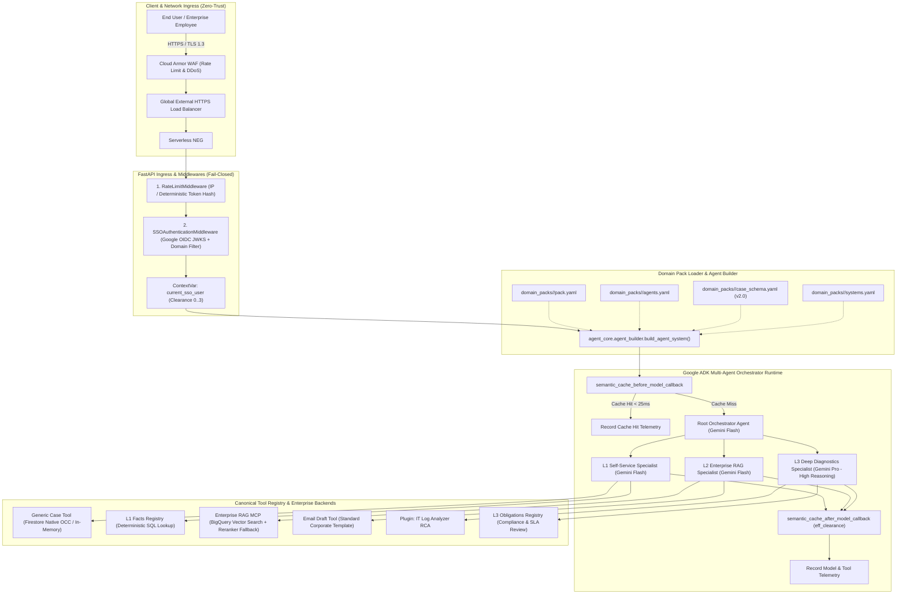
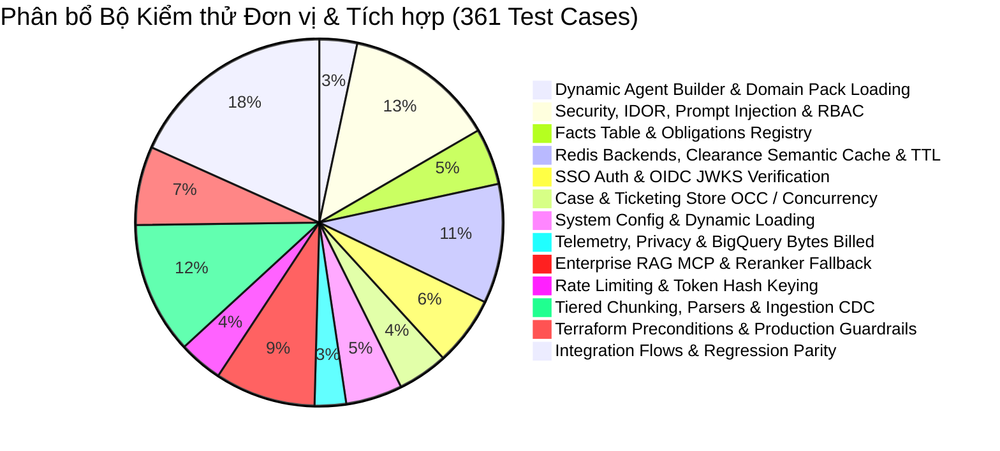

# TÀI LIỆU ĐẶC TẢ KỸ THUẬT VÀ THIẾT KẾ KIẾN TRÚC HỆ THỐNG
# (SYSTEM TECHNICAL SPECIFICATION & ARCHITECTURE DESIGN DOCUMENT)

**Dự án:** Enterprise Multi-Agent AI Platform (`agent_core`) & Domain Pack Architecture  
**Nền tảng:** Google Cloud Platform (GCP), Vertex AI Gemini 2.5 / 3 & Google Agent Development Kit (ADK)  
**Tác giả:** Solutions Architecture & Platform Engineering Team  
**Phiên bản:** `2.2.0-Enterprise` (Decoupled Domain Pack, Zero-Hardcode & Resilience-Hardened)  
**Trạng thái:** Approved & Production-Ready  
**Ngày cập nhật:** 02/09/2026  

---

## MỤC LỤC
1. [TỔNG QUAN HỆ THỐNG VÀ MỤC TIÊU KIẾN TRÚC](#1-tổng-quan-hệ-thống-và-mục-tiêu-kiến-trúc)
2. [KIẾN TRÚC TỔNG THỂ (HIGH-LEVEL ARCHITECTURE)](#2-kiến-trúc-tổng-thể-high-level-architecture)
3. [KIẾN TRÚC TÁCH RỜI DOMAIN PACK VÀ DYNAMIC AGENT BUILDER](#3-kiến-trúc-tách-rời-domain-pack-và-dynamic-agent-builder)
4. [PHÂN RÃ HỆ THỐNG ĐA ĐẶC VỤ, CANONICAL REGISTRY VÀ CASE STORE OCC](#4-phân-rã-hệ-thống-đa-đặc-vụ-canonical-registry-và-case-store-occ)
5. [KIẾN TRÚC BẢO MẬT VÀ PHÂN QUYỀN ZERO-TRUST (SECURITY, SSO & RBAC)](#5-kiến-trúc-bảo-mật-và-phân-quyền-zero-trust-security-sso--rbac)
6. [BỘ ĐỆM NGỮ NGHĨA PHÂN VÙNG CLEARANCE VÀ ĐIỀU TỐC (SEMANTIC CACHE & RATE LIMITING)](#6-bộ-đệm-ngữ-nghĩa-phân-vùng-clearance-và-điều-tốc-semantic-cache--rate-limiting)
7. [KIẾN TRÚC ENTERPRISE RAG, RERANKER FALLBACK, FACTS & OBLIGATIONS](#7-kiến-trúc-enterprise-rag-reranker-fallback-facts--obligations)
8. [HỆ THỐNG ĐO LƯỜNG VÀ BẢO VỆ QUYỀN RIÊNG TƯ (TELEMETRY & OBSERVABILITY)](#8-hệ-thống-đo-lường-và-bảo-vệ-quyền-riêng-tư-telemetry--observability)
9. [HẠ TẦNG TERRAFORM IAC, REDIS HA VÀ SECRET MANAGER](#9-hạ-tầng-terraform-iac-redis-ha-và-secret-manager)
10. [DANH MỤC API VÀ HỢP ĐỒNG DỮ LIỆU (API REFERENCE & DATA CONTRACTS)](#10-danh-mục-api-và-hợp-đồng-dữ-liệu-api-reference--data-contracts)
11. [QUY TRÌNH KIỂM THỬ 3-SUITE CI VÀ ĐẢM BẢO CHẤT LƯỢNG (TESTING & QA)](#11-quy-trình-kiểm-thử-3-suite-ci-và-đảm-bảo-chất-lượng-testing--qa)

---

## 1. TỔNG QUAN HỆ THỐNG VÀ MỤC TIÊU KIẾN TRÚC

### 1.1. Bối cảnh Doanh nghiệp
Hệ thống **Enterprise Multi-Agent AI Platform (`agent_core`)** là nền tảng AI Agent tự chủ đa tầng cấp doanh nghiệp (Multi-Tier Enterprise Autonomous Agent Platform). Nền tảng được thiết kế theo mô hình **Độc Lập Hạ Tầng (Infrastructure Isolation)**: mỗi khách hàng sở hữu 1 GCP Project riêng biệt, hoàn toàn không sử dụng chung cơ sở dữ liệu (No Shared Multi-Tenancy DB), loại bỏ triệt để nguy cơ rò rỉ dữ liệu chéo giữa các tổ chức và tuân thủ các chuẩn mực bảo mật ISO 27001, SOC 2 Type II và GDPR.

### 1.2. Mục tiêu Kỹ thuật Cốt lõi (Architectural Goals)
- **Decoupled Domain Pack Architecture**: Tách rời 100% mã nguồn Core Engine (`agent_core/`) khỏi định nghĩa nghiệp vụ (`domain_packs/`). Cho phép mở rộng sang mọi lĩnh vực (IT Helpdesk, Customer Operations, Pháp chế, Tài chính) chỉ qua khai báo declarative YAML.
- **Dynamic Agent Construction & Canonical Tool Resolution**: Khởi tạo cấu trúc cây Agent phân cấp và tự động phân giải công cụ từ `agent_core/tools/registry.py` tại runtime, loại bỏ hoàn toàn hardcoded agent factories.
- **Zero-Trust Security & Indirect Injection Defense**: Tự động tiêm chỉ dẫn phòng thủ Prompt Injection (`INDIRECT_PROMPT_INJECTION_DEFENSE_INSTRUCTION`) vào mọi Agent. Kiểm soát chặt chẽ xác thực Google OIDC JWKS, Fail-Closed domain whitelist và 4 cấp độ Clearance ($0 \dots 3$).
- **Optimistic Concurrency Control (OCC) & Audit Trail**: Quản lý trạng thái Case/Ticket với trường `version` chống ghi đè phân tán và nhật ký `history` bất biến (append-only).
- **Clearance-Aware Semantic Cache & Resilient RAG**: Phân vùng bộ đệm ngữ nghĩa theo quyền người dùng (`_c0..c3_`), ngăn chặn rò rỉ tri thức nhạy cảm, đồng thời trang bị cơ chế Re-ranker Circuit Breaker tự động fallback về BM25/Cosine khi quá tải.
- **Serverless Cost Efficiency ($0 Idle Cost)**: Sử dụng BigQuery Serverless Vector Search và Memorystore Redis với Secret Manager Auth/TLS, tối thiểu hóa chi phí hạ tầng tĩnh.

---

## 2. KIẾN TRÚC TỔNG THỂ (HIGH-LEVEL ARCHITECTURE)



---

## 3. KIẾN TRÚC TÁCH RỜI DOMAIN PACK VÀ DYNAMIC AGENT BUILDER

### 3.1. Cấu Trúc Thư Mục Domain Pack
Mọi tri thức, phân cấp tác tử và quy tắc nghiệp vụ đặc thù được đóng gói độc lập trong thư mục `domain_packs/<pack_id>/`:

```
domain_packs/<pack_id>/
├── pack.yaml          # Metadata: id, name, version, min_core_version, entry_agent
├── agents.yaml        # Khai báo agents, models, instructions, allowed tools, sub-agents
├── case_schema.yaml   # Schema v2.0: categories, priorities (P1..P4), status_transitions, tier_routing
├── systems.yaml       # Danh mục hệ thống nội bộ, vai trò truy cập (admin_roles, user_role_mappings)
├── eval_set.jsonl     # Bộ dữ liệu kiểm thử định tuyến đặc thù cho domain
└── README.md          # Tài liệu nghiệp vụ dành riêng cho Domain Pack
```

### 3.2. Cơ chế Dynamic Agent Builder (`agent_core/agent_builder.py`)
- **Kiểm tra Tương thích Phiên bản (`assert_core_compatibility`)**: So sánh `min_core_version` trong `pack.yaml` với `CORE_VERSION = "2.2.0"`. Từ chối khởi chạy (Fail-Closed) nếu phiên bản core thấp hơn yêu cầu.
- **Phân giải Công cụ Tự động & Canonical Fallback (`resolve_tools`)**: Đọc danh sách tên tool từ `agents.yaml`, tự động tìm kiếm trong Domain Pack hoặc fallback về [`agent_core/tools/registry.py`](agent_core/tools/registry.py). Nếu tool không tồn tại, hệ thống báo lỗi rõ ràng kèm danh sách tool hợp lệ.
- **Tiêm Phòng vệ Prompt Injection Tự động**: Tự động tiêm `INDIRECT_PROMPT_INJECTION_DEFENSE_INSTRUCTION` vào cuối instruction của mọi Agent:
  ```python
  full_instruction = f"{user_instruction}

{INDIRECT_PROMPT_INJECTION_DEFENSE_INSTRUCTION}"
  ```
- **Xây dựng Cây Phân cấp Đệ quy (`build_agent_hierarchy`)**: Duyệt cây `sub_agents` từ `entry_agent`, tạo các đối tượng `Agent` của Google ADK với đúng mô hình AI và danh sách công cụ đã phân giải.

---

## 4. PHÂN RÃ HỆ THỐNG ĐA ĐẶC VỤ, CANONICAL REGISTRY VÀ CASE STORE OCC

### 4.1. Cơ chế Canonical Tool Registry (`agent_core/tools/registry.py`)
Hệ thống quản lý công cụ tập trung qua decorator `@register_tool`, loại bỏ phụ thuộc vào các file cấu hình MCP cũ (đã deprecate `mcp_config.py`):

```python
TOOL_REGISTRY: dict[str, Callable] = {}

def register_tool(name: str):
    def decorator(fn: Callable):
        TOOL_REGISTRY[name] = fn
        return fn
    return decorator
```

### 4.2. Bảng Phân Tầng Đặc Vụ Chuẩn

| Tiêu chí | L1 Self-Service Specialist | L2 Enterprise RAG Specialist | L3 Deep Diagnostics Specialist |
| :--- | :--- | :--- | :--- |
| **Trọng tâm Nghiệp vụ** | FAQ, Tra cứu Fact cứng, Tự phục vụ, Quản lý Case/Ticket | Tra cứu tài liệu nghiệp vụ (ERP/HRM/CRM), Soạn email | Phân tích Log RCA, Rà soát SLA & Cam kết pháp lý |
| **Mô hình AI** | `gemini-2.5-flash` / `gemini-1.5-flash` | `gemini-2.5-flash` / `gemini-1.5-flash` | `gemini-2.5-pro` (Reasoning CoT) |
| **Công cụ Khả dụng** | `lookup_fact`, `create_case`, `get_case`, `list_user_cases`, `update_case_status` | `search_enterprise_knowledge`, `get_system_manual`, `draft_email_response` | `analyze_system_logs_for_rca`, `get_obligation`, `list_contract_obligations`, `review_it_contract_sla` |
| **Hạn mức Gọi** | 60 req/phút | 60 req/phút | **10 req/phút / user** (Bảo vệ Quota Gemini Pro) |

### 4.3. Quản lý Trạng Thái Case với Optimistic Concurrency Control (OCC)
Mô hình `CaseRecord` được thiết kế nhằm đảm bảo tính nhất quán dữ liệu phân tán:
- **Trường dữ liệu**: `case_id`, `user_id`, `title`, `description`, `category`, `priority` (`P1`..`P4`), `status`, `assigned_tier`, `version` (int), `history` (list[dict]), `created_at`, `updated_at`.
- **Cơ chế OCC**: Mỗi thao tác cập nhật (`update_case_status`, `escalate_case`, `resolve_case`) đều kiểm tra `expected_version == current_version`. Nếu phát hiện xung đột ghi đè đồng thời, hệ thống ném `CaseConcurrencyConflictError`.
- **Append-Only Audit Trail**: Mọi thay đổi trạng thái, người thực hiện, lý do và thời gian được ghi nối tiếp vào mảng `history`, đảm bảo khả năng kiểm toán 100%.

---

## 5. KIẾN TRÚC BẢO MẬT VÀ PHÂN QUYỀN ZERO-TRUST (SECURITY, SSO & RBAC)

### 5.1. Ma Trận Cấp Độ Bảo Mật Tri Thức (Clearance Level Matrix)

| Cấp độ | Tên Cấp độ (Clearance Level) | Đối tượng Truy cập | Phạm vi Dữ liệu & Tài liệu |
| :---: | :--- | :--- | :--- |
| **0** | **PUBLIC** | Tất cả nhân viên, khách hàng | FAQ chung, Hướng dẫn Wi-Fi, Máy in, Quy trình Reset Pass |
| **1** | **INTERNAL** | Nhân viên chính thức (`employee`) | Sổ tay nội bộ, Quy định chấm công HRM, Quy trình nghỉ phép |
| **2** | **CONFIDENTIAL** | Quản lý, Kỹ sư IT, Kế toán | Cấu hình mạng VPN, Sơ đồ ERP SAP, Danh sách Lead CRM |
| **3** | **RESTRICTED** | Ban Giám đốc, Lead SRE, Pháp chế | Hợp đồng SLA, Khóa bảo mật hạ tầng, Nhật ký Audit log |

### 5.2. 5 Lớp Phòng Thủ Chuyên Sâu (Defense-in-Depth)
1. **Lớp 1 (Ingress Authentication)**: `SSOAuthenticationMiddleware` kiểm tra chữ ký số RS256 qua Google JWKS (`accounts.google.com`), từ chối miền lạ qua `ALLOWED_DOMAINS` (Fail-Closed).
2. **Lớp 2 (Context Isolation)**: Lưu thông tin định danh `SSOUser` vào `ContextVar[Optional[SSOUser]]`, cô lập an toàn giữa các luồng xử lý đồng thời.
3. **Lớp 3 (Tool-Level RBAC & IDOR Defense)**: Helper `_get_and_authorize_case()` kiểm tra quyền sở hữu (`user_id == current_user.user_id`) hoặc vai trò quản trị (`admin_roles`).
4. **Lớp 4 (Parameterized Database Query)**: Lọc tham số `clearance_level <= @user_clearance` và `system IN UNNEST(@allowed_systems)` bằng câu truy vấn tham số hóa trong BigQuery.
5. **Lớp 5 (Multi-Tenant Cache Partitioning)**: Phân tách key namespace theo `_c0..c3_` và `user_id`, chặn rò rỉ tri thức có clearance cao sang public FAQ cache.

---

## 6. BỘ ĐỆM NGỮ NGHĨA PHÂN VÙNG CLEARANCE VÀ ĐIỀU TỐC (SEMANTIC CACHE & RATE LIMITING)

### 6.1. Redis Candidate-Set Vector Semantic Cache
- **Phân vùng Bảo mật (`clearance_level`)**: Khi lưu cache (`semantic_cache_after_model_callback`), hệ thống tính `eff_clearance = resolve_caller_clearance(...)`. Nếu `eff_clearance > 0`, bắt buộc đặt `is_public = False`.
- **First-Turn Gating cho Public FAQ**: Chỉ cho phép lưu vào public cache (`is_public = True`) khi `turn_count <= 1` (lượt hỏi đầu tiên), không gọi tool nhạy cảm và `clearance_level == 0`.
- **Candidate-Set Vector Matching**:
  - Tra cứu các vector ứng viên từ `public_keys_set` và `user_keys_set(user_id)`.
  - Thực thi bộ lọc nghiêm ngặt `entry.clearance_level <= caller_clearance`.
  - Tính Cosine Similarity trên mảng 768 chiều. Nếu đạt ngưỡng $\ge 0.92$, trả lời tức thì ($< 25	ext{ms}$).
- **TTL Phân cấp**: Public FAQ có TTL 4 giờ; User-specific cache có TTL 1 giờ.

### 6.2. Hệ Thống Điều Tốc (Rate Limiting)
- **Deterministic Token Hash Keying**: Băm định danh token `user:{sha256(token)}` hoặc Client IP để quản lý hạn mức truy cập.
- **JWT Single Verification Memoization**: Tái sử dụng kết quả giải mã token giữa `RateLimitMiddleware` và `SSOAuthenticationMiddleware` trong cùng một request.

---

## 7. KIẾN TRÚC ENTERPRISE RAG, RERANKER FALLBACK, FACTS & OBLIGATIONS

### 7.1. Động Cơ Enterprise RAG & Re-ranker Circuit Breaker
- **BigQuery Vector Search**: Thực thi truy vấn `VECTOR_SEARCH` trên dataset `it_helpdesk_kb`, áp dụng SQL pre-filtering theo `clearance_level <= @user_clearance`.
- **Cross-Encoder Re-ranker**: Chuẩn hóa điểm số và sắp xếp lại tài liệu theo độ tương quan ngữ cảnh sâu.
- **Graceful Fallback & Circuit Breaker**: Nếu model weights của Cross-Encoder không khả dụng hoặc bị quá tải, hệ thống tự động fallback mềm sang BM25 / Vector Cosine Distance, ghi log cảnh báo và duy trì phản hồi liên tục mà không gián đoạn dịch vụ.

### 7.2. Bảng Tri Thức Cứng (L1 Facts Registry)
- **Mục đích**: Loại bỏ hoàn toàn ảo giác (hallucination) cho các thông số kỹ thuật, hạn mức số học, địa chỉ IP/Port, ngưỡng SLA cố định.
- **Công cụ**: `@register_tool("lookup_fact")` thực hiện deterministic point-lookup qua `BaseFactsStore` (In-Memory hoặc BigQuery Table `enterprise_facts`).

### 7.3. Sổ Đăng Ký Cam Kết Pháp Lý (L3 Obligations Registry)
- **Mục đích**: Lưu trữ các điều khoản cam kết pháp lý, thời gian phản hồi MTTR, điều khoản bảo mật DPA/GDPR có giá trị ràng buộc.
- **Công cụ**: `@register_tool("get_obligation")` và `@register_tool("list_contract_obligations")` được bảo vệ nghiêm ngặt bằng phân quyền RBAC (`compliance_officer`, `legal_counsel`, `it_admin`).

---

## 8. HỆ THỐNG ĐO LƯỜNG VÀ BẢO VỆ QUYỀN RIÊNG TƯ (TELEMETRY & OBSERVABILITY)

- **Structured Cloud Logging**: Xuất JSON log chuẩn hóa lên Google Cloud Logging.
- **Quyền Riêng Tư Mặc Định (Fail-Closed Privacy)**:
  - `TELEMETRY_ANONYMIZE_USERS=true`: Băm định danh người dùng bằng SHA-256 (`anon_...`).
  - `TELEMETRY_INCLUDE_QUERY=false`: Ẩn nội dung truy vấn của người dùng thành `[REDACTED_PRIVACY]`.
- **Đo Lường Độ Trễ Chính Xác**: Sử dụng `time.perf_counter()` đo lường từ đầu đến cuối lượt hội thoại qua `ContextVar`.

---

## 9. HẠ TẦNG TERRAFORM IAC, REDIS HA VÀ SECRET MANAGER

### 9.1. Ràng Buộc Kiểm Soát Terraform (Lifecycle Preconditions)
Bộ mã Terraform tại `deployment/terraform/` áp dụng các khối kiểm tra nghiêm ngặt:
- `precondition`: Ngăn chặn deploy Production nếu `allowed_domains` bị rỗng hoặc chứa wildcard `*`.
- `precondition`: Ngăn chặn deploy Production nếu `min_instance_count < 1`.
- `precondition`: Ngăn chặn deploy Production nếu `knowledge_backend == "in_memory"`.
- `precondition`: Cảnh báo rủi ro nếu `allow_unauthenticated = true` mà không có Cloud Armor WAF.

### 9.2. Memorystore Redis HA & Secret Manager
- **Bảo mật Kết nối**: `auth_enabled = true` và `transit_encryption_mode = "SERVER_AUTHENTICATION"`.
- **Secret Manager Integration**: Lưu trữ tự động `redis_auth` và `redis_ca_cert` vào GCP Secret Manager và cấp quyền đọc an toàn cho Service Account của Cloud Run.

---

## 10. DANH MỤC API VÀ HỢP ĐỒNG DỮ LIỆU (API REFERENCE & DATA CONTRACTS)

### 10.1. Tự Động Tắt API Documentation trên Production
Vô hiệu hóa `/docs`, `/redoc`, `/openapi.json` khi `ENVIRONMENT=production` hoặc `K_SERVICE` tồn tại.

### 10.2. Các Endpoint Cốt Lõi

#### 1. `GET /healthz` & `GET /readyz`
- **Mục đích**: Liveness & Readiness probe cho Cloud Run.
- **Phản hồi**:
  ```json
  {
    "status": "healthy",
    "service": "it-helpdesk-agent",
    "core_version": "2.2.0",
    "pack_id": "it-helpdesk",
    "pack_version": "1.0.0",
    "timestamp": 1756850000.0
  }
  ```

#### 2. `GET /api/auth/me`
- **Mục đích**: Trả về hồ sơ định danh, clearance level và danh sách vai trò (roles) của người dùng đã xác thực SSO.

#### 3. `GET /api/cache/stats`
- **Mục đích**: Báo cáo tổng hợp số lượng keys trong Redis/Memory, tỉ lệ hit/miss, và số mục cache theo từng cấp độ clearance.

---

## 11. QUY TRÌNH KIỂM THỬ 3-SUITE CI VÀ ĐẢM BẢO CHẤT LƯỢNG (TESTING & QA)

Hệ thống sở hữu bộ kiểm thử tự động toàn diện với **361 test cases**, đạt độ bao phủ mã nguồn **>92%** và tỷ lệ vượt qua **100% Pass** trên cả 3 môi trường:



### 3-Suite CI Execution Protocol:
```bash
# Suite 1: Môi trường Development với Local SSO
ENVIRONMENT=development ALLOW_LOCAL_DEV_SSO=true .venv/bin/pytest tests/ -q
# Kết quả: 361 passed in ~85s

# Suite 2: Môi trường Production không cho phép Local SSO (Fail-Closed)
ENVIRONMENT=production ALLOW_LOCAL_DEV_SSO=false .venv/bin/pytest tests/ -q
# Kết quả: 361 passed in ~89s

# Suite 3: Cô lập Domain Pack Template
DOMAIN_PACK=_template ENVIRONMENT=development .venv/bin/pytest tests/ -q
# Kết quả: 361 passed in ~86s
```
