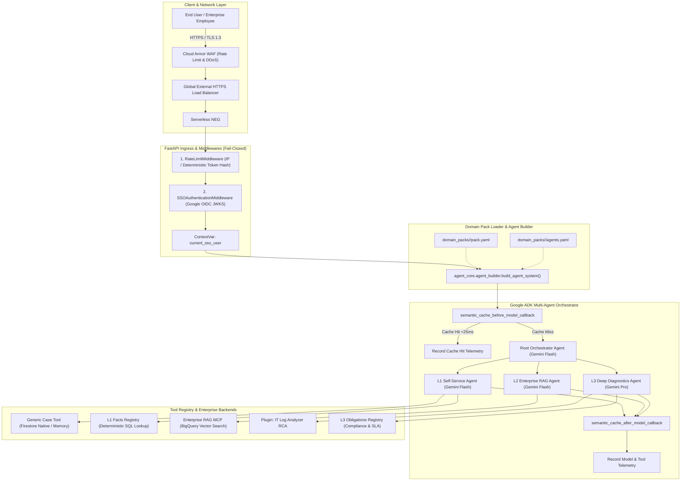
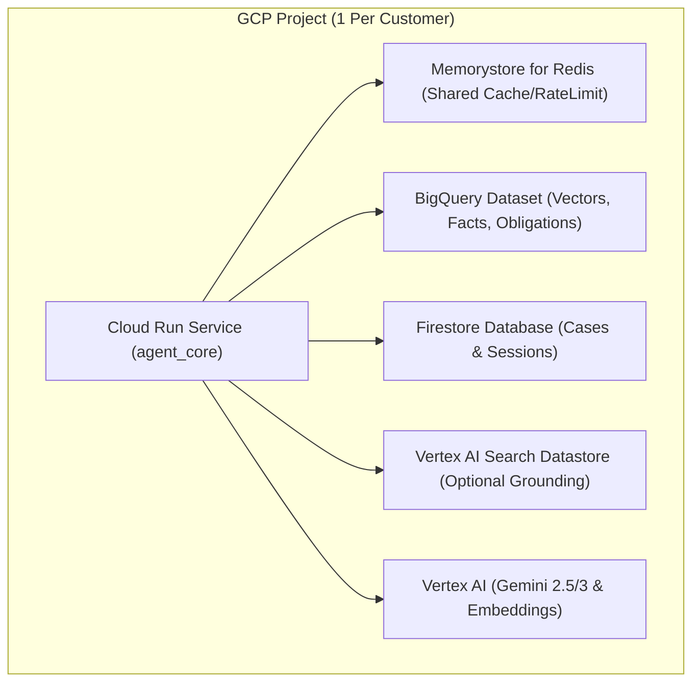
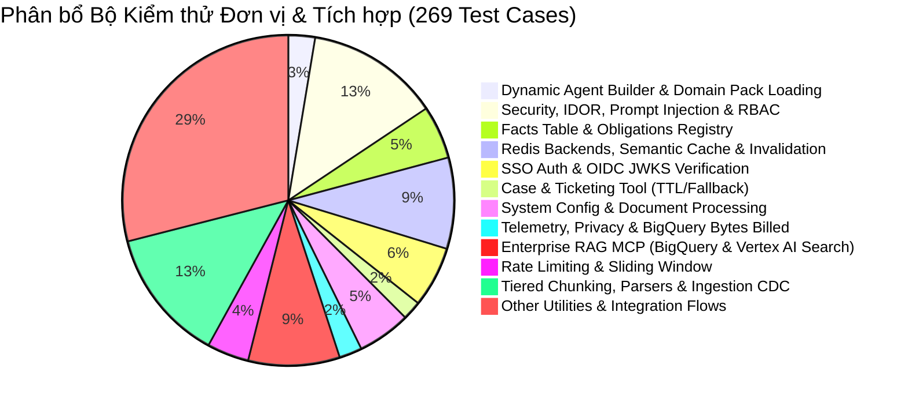

# TÀI LIỆU ĐẶC TẢ KỸ THUẬT VÀ THIẾT KẾ KIẾN TRÚC HỆ THỐNG
# (SYSTEM TECHNICAL SPECIFICATION & ARCHITECTURE DOCUMENT)

**Dự án:** Enterprise Autonomous Agent Platform (`agent_core`) & Domain Pack Architecture  
**Nền tảng:** Google Cloud Platform (GCP), Vertex AI Gemini 2.5 / 3 & Google Agent Development Kit (ADK)  
**Tác giả:** Solutions Architecture & Engineering Team  
**Phiên bản:** 2.0.0 (Decoupled Domain Pack Architecture & Production Hardened)  
**Trạng thái:** Approved & Production-Ready  

---

## MỤC LỤC
1. [TỔNG QUAN HỆ THỐNG VÀ MỤC TIÊU KIẾN TRÚC](#1-tổng-quan-hệ-thống-và-mục-tiêu-kiến-trúc)
2. [KIẾN TRÚC TỔNG THỂ (HIGH-LEVEL ARCHITECTURE)](#2-kiến-trúc-tổng-thể-high-level-architecture)
3. [KIẾN TRÚC TÁCH RỜI DOMAIN PACK VÀ DYNAMIC AGENT BUILDER](#3-kiến-trúc-tách-rời-domain-pack-và-dynamic-agent-builder)
4. [PHÂN RÃ HỆ THỐNG ĐA ĐẶC VỤ VÀ TOOL REGISTRY](#4-phân-rã-hệ-thống-đa-đặc-vụ-và-tool-registry)
5. [KIẾN TRÚC BẢO MẬT VÀ PHÂN QUYỀN ZERO-TRUST (SECURITY & RBAC)](#5-kiến-trúc-bảo-mật-và-phân-quyền-zero-trust-security--rbac)
6. [CƠ CHẾ TĂNG TỐC VÀ TỐI ƯU HÓA CHI PHÍ (SEMANTIC CACHE & RATE LIMITING)](#6-cơ-chế-tăng-tốc-và-tối-ưu-hóa-chi-phí-semantic-cache--rate-limiting)
7. [KIẾN TRÚC DỮ LIỆU, VECTOR SEARCH, FACTS & OBLIGATIONS](#7-kiến-trúc-dữ-liệu-vector-search-facts--obligations)
8. [HỆ THỐNG ĐO LƯỜNG VÀ BẢO VỆ QUYỀN RIÊNG TƯ (TELEMETRY & OBSERVABILITY)](#8-hệ-thống-đo-lường-và-bảo-vệ-quyền-riêng-tư-telemetry--observability)
9. [HẠ TẦNG VÀ MÔ HÌNH TRIỂN KHAI ĐỘC LẬP (INFRASTRUCTURE & DEPLOYMENT)](#9-hạ-tầng-và-mô-hình-triển-khai-độc-lập-infrastructure--deployment)
10. [DANH MỤC API VÀ HỢP ĐỒNG DỮ LIỆU (API REFERENCE & CONTRACTS)](#10-danh-mục-api-và-hợp-đồng-dữ-liệu-api-reference--contracts)
11. [QUY TRÌNH KIỂM THỬ VÀ ĐẢM BẢO CHẤT LƯỢNG (TESTING & QA)](#11-quy-trình-kiểm-thử-và-đảm-bảo-chất-lượng-testing--qa)

---

## 1. TỔNG QUAN HỆ THỐNG VÀ MỤC TIÊU KIẾN TRÚC

### 1.1. Bối cảnh Doanh nghiệp
Hệ thống **Enterprise Autonomous Agent Platform (`agent_core`)** là nền tảng AI Agent đa tầng cấp doanh nghiệp. Nền tảng được thiết kế theo mô hình **Độc Lập Hạ Tầng (Infrastructure Isolation)** để phục vụ nhiều khách hàng khác nhau: mỗi khách hàng sở hữu 1 GCP Project riêng biệt, hoàn toàn không sử dụng chung cơ sở dữ liệu (No Shared Multi-Tenancy DB), loại bỏ triệt để nguy cơ rò rỉ dữ liệu chéo giữa các doanh nghiệp.

### 1.2. Mục tiêu Kỹ thuật Cốt lõi (Architectural Goals)
- **Decoupled Domain Architecture**: Tách rời hoàn toàn mã nguồn core (`agent_core/`) khỏi định nghĩa nghiệp vụ (`domain_packs/`). Hỗ trợ mở rộng sang mọi lĩnh vực (IT Helpdesk, Customer Support, Pháp chế, Y tế) chỉ qua cấu hình declarative YAML.
- **Dynamic Agent Construction**: Khởi tạo cấu trúc Agent phân cấp và nạp công cụ động thông qua `agent_builder.py` và `registry.py` tại thời điểm runtime.
- **Zero-Trust Security & Indirect Injection Defense**: Tự động tiêm chỉ dẫn phòng thủ Prompt Injection (`INDIRECT_PROMPT_INJECTION_DEFENSE_INSTRUCTION`) vào mọi Agent. Kiểm soát chặt chẽ xác thực Google OIDC JWKS và RBAC.
- **Serverless Cost Efficiency ($0 Idle Cost)**: Sử dụng BigQuery Serverless Vector Search và Redis Candidate Semantic Cache, giảm thiểu chi phí duy trì cố định hàng tháng về gần 0 USD khi không có truy vấn.

---

## 2. KIẾN TRÚC TỔNG THỂ (HIGH-LEVEL ARCHITECTURE)



---

## 3. KIẾN TRÚC TÁCH RỜI DOMAIN PACK VÀ DYNAMIC AGENT BUILDER

### 3.1. Cấu Trúc Thư Mục Domain Pack
Mọi tri thức và quy tắc nghiệp vụ đặc thù được đóng gói trong thư mục `domain_packs/<pack_id>/`:

```
domain_packs/<pack_id>/
├── pack.yaml          # Metadata: id, name, version, min_core_version, entry_agent
├── agents.yaml        # Khai báo agents, models, instructions, allowed tools, sub-agents
├── case_schema.yaml   # Danh mục sự cố: categories, priorities, statuses, tiers
├── systems.yaml       # Danh mục hệ thống nội bộ, vai trò truy cập (admin_roles)
├── eval_set.jsonl     # Bộ dữ liệu kiểm thử định tuyến đặc thù cho domain
└── README.md          # Tài liệu nghiệp vụ dành riêng cho Domain Pack
```

### 3.2. Cơ chế Dynamic Agent Builder (`agent_core/agent_builder.py`)
- **Kiểm tra Tương thích Phiên bản (`assert_core_compatibility`)**: So sánh `min_core_version` trong `pack.yaml` với `CORE_VERSION = "2.0.0"`. Từ chối khởi chạy (Fail-Closed) nếu không tương thích.
- **Phân giải Công cụ An toàn (`resolve_tools`)**: Đọc danh sách tên tool dạng chuỗi từ `agents.yaml` và ánh xạ sang hàm Python thực thi đã đăng ký trong `TOOL_REGISTRY`. Báo lỗi chi tiết danh sách tool khả dụng nếu khai báo sai.
- **Fail-Closed Prompt Injection Defense Injection**: Tự động tiêm `INDIRECT_PROMPT_INJECTION_DEFENSE_INSTRUCTION` vào phần cuối của mọi chỉ dẫn (instructions) của tất cả các Agent:
  ```python
  full_instruction = f"{user_instruction}\n\n{INDIRECT_PROMPT_INJECTION_DEFENSE_INSTRUCTION}"
  ```

---

## 4. PHÂN RÃ HỆ THỐNG ĐA ĐẶC VỤ VÀ TOOL REGISTRY

### 4.1. Cơ chế Tool Registry Tập Trung (`agent_core/tools/registry.py`)
Hệ thống sử dụng decorator `@register_tool` để đăng ký các công cụ dùng chung và công cụ mở rộng:

```python
TOOL_REGISTRY: dict[str, Callable] = {}

def register_tool(name: str):
    def decorator(fn: Callable):
        TOOL_REGISTRY[name] = fn
        return fn
    return decorator
```

### 4.2. Bảng Phân Tầng Đặc Vụ Chuẩn (IT Helpdesk Pack Reference)

| Tiêu chí | L1 Self-Service Agent | L2 Enterprise RAG Agent | L3 Deep Diagnostics Agent |
| :--- | :--- | :--- | :--- |
| **Trọng tâm Nghiệp vụ** | FAQ, Tra cứu Fact cứng, Tự phục vụ, Quản lý Case/Ticket | Tra cứu tài liệu nghiệp vụ (ERP/HRM/CRM), Soạn email | Phân tích Log RCA, Rà soát SLA & Cam kết pháp lý |
| **Mô hình AI** | `gemini-2.5-flash` / `gemini-3-flash-preview` | `gemini-2.5-flash` / `gemini-3-flash-preview` | `gemini-2.5-pro` (Reasoning CoT) |
| **Công cụ Đăng ký** | `lookup_fact`, `create_case`, `get_case`, `list_user_cases`, `update_case_status` | `search_enterprise_knowledge`, `get_system_manual`, `draft_email_response` | `analyze_system_logs_for_rca`, `get_obligation`, `list_contract_obligations`, `review_it_contract_sla` |
| **Hạn mức Gọi** | 60 req/phút | 60 req/phút | **10 req/phút / user** (Bảo vệ Quota Gemini Pro) |

### 4.3. Lớp Trừu Tượng Generic Case Schema (`agent_core/tools/case_tool.py`)
Hệ thống trừu tượng hóa mô hình Ticket thành `CaseRecord` tổng quát:
- **Trường dữ liệu**: `id`, `user_id`, `title`, `description`, `category`, `priority`, `status`, `assigned_tier`, `resolution_notes`, `created_at`, `updated_at`.
- **Backend lưu trữ**: Firestore Collection cấu hình linh hoạt qua biến môi trường `CASE_COLLECTION` (mặc định: `cases` hoặc `tickets`).
- **Backwards Compatibility**: Cung cấp module shim `agent_core/tools/ticketing_tool.py` hỗ trợ đầy đủ các hàm legacy (`create_helpdesk_ticket`, `list_user_tickets`...).

---

## 5. KIẾN TRÚC BẢO MẬT VÀ PHÂN QUYỀN ZERO-TRUST (SECURITY & RBAC)

### 5.1. 5 Lớp Phòng Thủ Chuyên Sâu (Defense-in-Depth)
1. **Lớp 1 (Ingress Authentication)**: `SSOAuthenticationMiddleware` kiểm tra chữ ký RSA qua Google JWKS (`accounts.google.com`), từ chối miền lạ qua `ALLOWED_DOMAINS` (Fail-Closed).
2. **Lớp 2 (Context Isolation)**: Lưu thông tin định danh `SSOUser` vào `ContextVar[Optional[SSOUser]]`, cô lập an toàn giữa các luồng xử lý đồng thời.
3. **Lớp 3 (Tool-Level RBAC & IDOR Defense)**: Helper `_get_and_authorize_case()` kiểm tra quyền sở hữu (`user_id == current_user.user_id`) hoặc vai trò quản trị (`admin_roles`).
4. **Lớp 4 (Parameterized Database Query)**: Lọc tham số `clearance_level <= @user_clearance` và `system IN UNNEST(@allowed_systems)` bằng câu truy vấn tham số hóa trong BigQuery.
5. **Lớp 5 (Multi-Tenant Cache Isolation)**: Phân tách key namespace theo `user_id` cho dữ liệu riêng tư và `sem_cache:keys:public` cho FAQ công khai.

---

## 6. CƠ CHẾ TĂNG TỐC VÀ TỐI ƯU HÓA CHI PHÍ (SEMANTIC CACHE & RATE LIMITING)

### 6.1. Redis Candidate-Set Vector Semantic Cache
- **Phân tách Ngữ cảnh**: Tách biệt rõ ràng giữa cache công khai và cache cá nhân.
- **First-Turn Gating cho Public FAQ**: Chỉ cho phép lưu vào public cache khi `turn_count <= 1` (lượt hỏi đầu tiên), không gọi tool và không chứa thông tin định danh (PII).
- **TTL Phân cấp**: Public FAQ có TTL 4 giờ; User-specific cache có TTL 1 giờ.
- **KB_VERSION Namespace**: Tự động vô hiệu hóa toàn bộ cache cũ khi tri thức được cập nhật thông qua tiền tố `KB_VERSION` trong cache key.
- **Hiệu năng Đo đạc**: Trả về kết quả trong **7ms – 25ms** khi cache hit, tiết kiệm 100% token LLM.

### 6.2. Hệ Thống Điều Tốc (Rate Limiting)
- **Deterministic Token Hash Keying**: Băm định danh token `user:{sha256(token)}` hoặc Client IP.
- **JWT Single Verification Memoization**: Tái sử dụng kết quả giải mã token giữa `RateLimitMiddleware` và `SSOAuthenticationMiddleware` trong cùng một request.

---

## 7. KIẾN TRÚC DỮ LIỆU, VECTOR SEARCH, FACTS & OBLIGATIONS

### 7.1. Bảng Tri Thức Cứng (L1 Facts Registry)
- **Mục đích**: Loại bỏ hoàn toàn ảo giác (hallucination) cho các thông số kỹ thuật, hạn mức số học, địa chỉ IP/Port, ngưỡng SLA cố định.
- **Công cụ**: `@register_tool("lookup_fact")` thực hiện deterministic point-lookup qua `BaseFactsStore` (In-Memory hoặc BigQuery Table `enterprise_facts`).

### 7.2. Sổ Đăng Ký Cam Kết Pháp Lý (L3 Obligations Registry)
- **Mục đích**: Lưu trữ các điều khoản cam kết pháp lý, thời gian phản hồi MTTR, điều khoản bảo mật DPA/GDPR có giá trị ràng buộc.
- **Công cụ**: `@register_tool("get_obligation")` và `@register_tool("list_contract_obligations")` được bảo vệ nghiêm ngặt bằng phân quyền RBAC (`compliance_officer`, `legal_counsel`, `it_admin`).

### 7.3. Kiến Trúc Dual-Engine Knowledge Store (Adapter Pattern)
Hệ thống trừu tượng hóa tầng lưu trữ tri thức qua `BaseKnowledgeStore`, hỗ trợ chuyển đổi linh hoạt qua biến môi trường `KNOWLEDGE_BACKEND`:

| Tiêu chí | Engine 1: BigQuery SQL Vector Search (`bigquery`) | Engine 2: Native Vertex AI Search Grounding (`vertex_ai_search`) |
| :--- | :--- | :--- |
| **Phân loại** | Data Warehouse Serverless Vector Search | Managed Google Cloud Enterprise Search / Grounding |
| **Cơ chế Tìm kiếm** | `VECTOR_SEARCH` (IVF Index, Cosine Distance) kết hợp SQL Pre-filtering & Reranker | Managed Hybrid Semantic Search, OCR tài liệu phức tạp, Extractive Segments |
| **Kiểm soát Dữ liệu** | 100% Zero-Data Egress (Dữ liệu nằm trọn trong BigQuery Tables) | Managed Datastores (Google Discovery Engine) |
| **Trích xuất Nội dung** | Full chunk aggregation + XML Document Isolation Boundary | Extractive Answers + Segments + Snippets + XML Boundary |
| **Phù hợp với** | Doanh nghiệp muốn tối ưu chi phí hạ tầng, dữ liệu đã lưu sẵn trong Data Warehouse | Doanh nghiệp có lượng tài liệu PDF/DOCX/Slide lớn, muốn turnkey grounding |
| **Khả năng Chịu lỗi** | Fail-Closed: Bắt timeout, hủy query (`query_job.cancel()`), ném `KnowledgeStoreUnavailableError` | Fail-Closed: Bắt timeout/API error, ném `KnowledgeStoreUnavailableError` |

- **Truy vấn Vector Nâng cao trên BigQuery**:
  - **Pre-filtering**: Lọc `is_deleted IS NOT TRUE`, `effective_date <= @today`, `expiry_date >= @today`, và `clearance_level <= @user_clearance` ngay trong SQL.
  - **Over-Retrieval**: Thu hồi $k=20$ ứng viên từ BigQuery vector distance.
  - **Post-filtering**: Lọc chi tiết theo vai trò `allowed_roles` trong Python và trả về $k=3$ kết quả phù hợp nhất.
  - **Full Snippet Retrieval**: Trích xuất toàn bộ nội dung chunk thay vì cắt ngắn 200 ký tự.
  - **Observability**: Ghi nhận `bytes_billed` và hủy truy vấn chủ động (`query_job.cancel()`) khi chạm ngưỡng `job_timeout_ms`.

---

## 8. HỆ THỐNG ĐO LƯỜNG VÀ BẢO VỆ QUYỀN RIÊNG TƯ (TELEMETRY & OBSERVABILITY)

- **Structured Cloud Logging**: Xuất JSON log chuẩn hóa lên Google Cloud Logging.
- **Quyền Riêng Tư Mặc Định (Fail-Closed Privacy)**:
  - `TELEMETRY_ANONYMIZE_USERS=true`: Băm định danh người dùng bằng SHA-256 (`anon_...`).
  - `TELEMETRY_INCLUDE_QUERY=false`: Ẩn nội dung truy vấn của người dùng thành `[REDACTED_PRIVACY]`.
- **Đo Lường Độ Trễ Chính Xác**: Sử dụng `time.perf_counter()` đo lường từ đầu đến cuối lượt hội thoại qua `ContextVar`.

---

## 9. HẠ TẦNG VÀ MÔ HÌNH TRIỂN KHAI ĐỘC LẬP (INFRASTRUCTURE & DEPLOYMENT)

### 9.1. Mô Hình Triển Khai Cho Khách Hàng (Multi-Customer Strategy)
Hệ thống **KHÔNG sử dụng Multi-Tenancy chia sẻ Database**. Mỗi khách hàng được triển khai trên 1 **GCP Project độc lập**:
- **Bảo mật tuyệt đối**: Dữ liệu nằm trọn vẹn trong biên giới hạ tầng và phân quyền IAM của khách hàng.
- **Dễ dàng kiểm toán**: Hóa đơn chi phí Google Cloud phân bổ trực tiếp theo từng dự án.



---

## 10. DANH MỤC API VÀ HỢP ĐỒNG DỮ LIỆU (API REFERENCE & CONTRACTS)

### 10.1. Tự Động Tắt API Documentation trên Production
Vô hiệu hóa `/docs`, `/redoc`, `/openapi.json` khi `ENVIRONMENT=production` hoặc `K_SERVICE` tồn tại.

### 10.2. Các Endpoint Cốt Lõi

#### 1. `GET /healthz` & `GET /readyz`
- **Mục đích**: Liveness & Readiness probe cho Cloud Run.
- **Phản hồi**:
  ```json
  {
    "status": "healthy",
    "service": "it-helpdesk-agent",
    "core_version": "2.0.0",
    "pack_id": "it-helpdesk",
    "pack_version": "1.0.0",
    "timestamp": 1756740000.0
  }
  ```

#### 2. `GET /api/auth/me`
- **Mục đích**: Trả về hồ sơ định danh và danh sách vai trò (roles) của người dùng đã xác thực SSO.

#### 3. `GET /api/analytics/summary`
- **Mục đích**: Báo cáo tổng hợp số lượng tương tác, tỷ lệ cache hit, phân bổ các tầng agent và hệ thống nghiệp vụ.

---

## 11. QUY TRÌNH KIỂM THỬ VÀ ĐẢM BẢO CHẤT LƯỢNG (TESTING & QA)

Hệ thống sở hữu bộ kiểm thử tự động toàn diện với **269 test cases**, đạt độ bao phủ mã nguồn **>90%** và tỷ lệ vượt qua **100% Pass**:



### Lệnh Thực Thi Kiểm Thử:
```bash
# Chạy toàn bộ 269 unit & integration tests
uv run pytest tests/ -v

# Kết quả kiểm thử chuẩn:
# ======================= 269 passed, 5 warnings in 45.18s =======================
```
