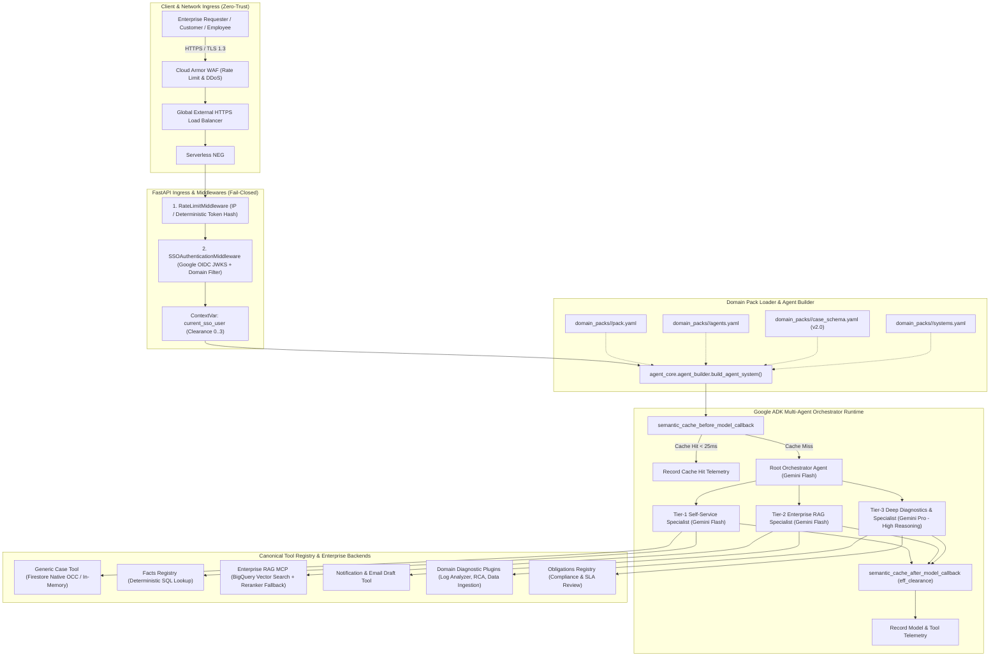
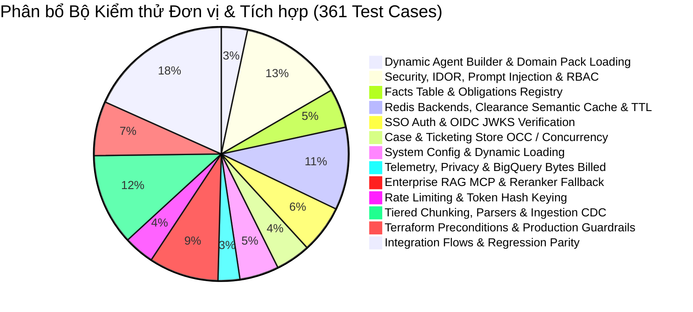

# TÀI LIỆU ĐẶC TẢ KỸ THUẬT VÀ THIẾT KẾ KIẾN TRÚC HỆ THỐNG
# (ENTERPRISE MULTI-AGENT PLATFORM - TECHNICAL SPECIFICATION & ARCHITECTURE DESIGN)

**Nền tảng:** Enterprise Autonomous Multi-Agent AI Platform (`agent_core`)  
**Công nghệ Cốt lõi:** Google Cloud Platform (GCP), Vertex AI Gemini 2.5 / 3 & Google Agent Development Kit (ADK)  
**Tác giả:** Solutions Architecture & Platform Engineering Team  
**Phiên bản:** `2.2.0-Enterprise` (Domain-Agnostic Platform, Decoupled Domain Packs & Zero-Hardcode Architecture)  
**Trạng thái:** Approved & Production-Ready  
**Ngày cập nhật:** 02/09/2026  

---

## MỤC LỤC
1. [TỔNG QUAN NỀN TẢNG VÀ MỤC TIÊU KIẾN TRÚC](#1-tổng-quan-nền-tảng-và-mục-tiêu-kiến-trúc)
2. [KIẾN TRÚC TỔNG THỂ NỀN TẢNG (HIGH-LEVEL ARCHITECTURE)](#2-kiến-trúc-tổng-thể-nền-tảng-high-level-architecture)
3. [KIẾN TRÚC TÁCH RỜI DOMAIN PACK VÀ DYNAMIC AGENT BUILDER](#3-kiến-trúc-tách-rời-domain-pack-và-dynamic-agent-builder)
4. [PHÂN RÃ HỆ THỐNG ĐA ĐẶC VỤ, CANONICAL REGISTRY VÀ CASE STORE OCC](#4-phân-rã-hệ-thống-đa-đặc-vụ-canonical-registry-và-case-store-occ)
5. [KIẾN TRÚC BẢO MẬT VÀ PHÂN QUYỀN ZERO-TRUST (SECURITY, SSO & RBAC)](#5-kiến-trúc-bảo-mật-và-phân-quyền-zero-trust-security-sso--rbac)
6. [BỘ ĐỆM NGỮ NGHĨA PHÂN VÙNG CLEARANCE VÀ ĐIỀU TỐC (SEMANTIC CACHE & RATE LIMITING)](#6-bộ-đệm-ngữ-nghĩa-phân-vùng-clearance-và-điều-tốc-semantic-cache--rate-limiting)
7. [KIẾN TRÚC ENTERPRISE RAG, RERANKER FALLBACK, FACTS & OBLIGATIONS](#7-kiến-trúc-enterprise-rag-reranker-fallback-facts--obligations)
8. [HỆ THỐNG ĐO LƯỜNG VÀ BẢO VỆ QUYỀN RIÊNG TƯ (TELEMETRY & OBSERVABILITY)](#8-hệ-thống-đo-lường-và-bảo-vệ-quyền-riêng-tư-telemetry--observability)
9. [HẠ TẦNG TERRAFORM IAC, REDIS HA VÀ SECRET MANAGER](#9-hạ-tầng-terraform-iac-redis-ha-và-secret-manager)
10. [DANH MỤC API VÀ HỢP ĐỒNG DỮ LIỆU (API REFERENCE & DATA CONTRACTS)](#10-danh-mục-api-và-hợp-đồng-dữ-liệu-api-reference--data-contracts)
11. [QUY TRÌNH KIỂM THỬ 3-SUITE CI VÀ ĐẢM BẢO CHẤT LƯỢNG (TESTING & QA)](#11-quy-trình-kiểm-thử-3-suite-ci-và-đảm-bảo-chất-lượng-testing--qa)

---

## 1. TỔNG QUAN NỀN TẢNG VÀ MỤC TIÊU KIẾN TRÚC

### 1.1. Bối cảnh & Định vị Nền tảng (Platform Positioning)
**Enterprise Multi-Agent AI Platform (`agent_core`)** là nền tảng AI Agent tự chủ đa tầng cấp doanh nghiệp (Multi-Tier Enterprise Autonomous Agent Platform). Hệ thống được thiết kế hoàn toàn **phi phụ thuộc lĩnh vực (Domain-Agnostic)**:
- **Tầng Nền tảng (`agent_core/`)**: Cung cấp toàn bộ năng lực lõi bao gồm: Xác thực SSO OIDC & RBAC, Dynamic Agent Builder, Canonical Tool Registry, Clearance-Aware Semantic Cache, Dual-Engine RAG, Optimistic Concurrency Control (OCC) Case Management, và Distributed Telemetry.
- **Tầng Gói Nghiệp vụ (`domain_packs/`)**: Đóng gói toàn bộ cấu trúc phân cấp tác tử, chỉ dẫn chuyên môn (Instructions), quy tắc phân loại sự cố (`case_schema.yaml`), danh mục hệ thống nội bộ (`systems.yaml`) và kho tri thức đặc thù. Nền tảng có thể phục vụ bất kỳ lĩnh vực nào trong doanh nghiệp:
  - **IT Operations & Helpdesk** (`domain_packs/it-helpdesk/` - Reference Implementation): Hỗ trợ kỹ thuật, ERP/HRM/CRM manuals, phân tích log sự cố RCA, rà soát cam kết SLA hợp đồng.
  - **Human Resources & Employee Services** (`domain_packs/hr-service/`): Quy chế nhân sự, tính lương, phúc lợi, nghỉ phép, onboarding.
  - **Legal & Compliance** (`domain_packs/legal-compliance/`): Rà soát hợp đồng, điều khoản tuân thủ DPA/GDPR/SOC2, kiểm soát rủi ro pháp lý.
  - **Customer Support & Operations** (`domain_packs/customer-ops/`): Chăm sóc khách hàng, tra cứu chính sách bảo hành, xử lý khiếu nại dịch vụ.
  - **Financial Shared Services** (`domain_packs/financial-services/`): Quy trình thanh quyết toán, hóa đơn, phê duyệt ngân sách.

### 1.2. Mục tiêu Kỹ thuật Cốt lõi (Architectural Goals)
- **Decoupled Domain Pack Architecture**: Tách rời 100% mã nguồn Core Engine (`agent_core/`) khỏi định nghĩa nghiệp vụ (`domain_packs/`). Cho phép mở rộng sang bất kỳ bài toán nghiệp vụ nào chỉ qua khai báo declarative YAML.
- **Dynamic Agent Construction & Canonical Tool Resolution**: Khởi tạo cấu trúc cây Agent phân cấp và tự động phân giải công cụ từ [`agent_core/tools/registry.py`](agent_core/tools/registry.py) tại runtime, loại bỏ hoàn toàn hardcoded agent factories.
- **Zero-Trust Security & Indirect Injection Defense**: Tự động tiêm chỉ dẫn phòng thủ Prompt Injection (`INDIRECT_PROMPT_INJECTION_DEFENSE_INSTRUCTION`) vào mọi Agent. Kiểm soát chặt chẽ xác thực Google OIDC JWKS, Fail-Closed domain whitelist và 4 cấp độ Clearance ($0 \dots 3$).
- **Optimistic Concurrency Control (OCC) & Audit Trail**: Quản lý trạng thái Case/Ticket với trường `version` chống ghi đè phân tán và nhật ký `history` bất biến (append-only).
- **Clearance-Aware Semantic Cache & Resilient RAG**: Phân vùng bộ đệm ngữ nghĩa theo quyền người dùng (`_c0..c3_`), ngăn chặn rò rỉ tri thức nhạy cảm, đồng thời trang bị cơ chế Re-ranker Circuit Breaker tự động fallback về BM25/Cosine khi quá tải.
- **Serverless Cost Efficiency ($0 Idle Cost)**: Sử dụng BigQuery Serverless Vector Search và Memorystore Redis với Secret Manager Auth/TLS, tối thiểu hóa chi phí hạ tầng tĩnh.
- **Infrastructure-Isolated Multi-Tenancy**: Triển khai theo mô hình 1 Khách hàng / Tenant = 1 GCP Project riêng biệt, đảm bảo cô lập dữ liệu tuyệt đối và không dùng chung database (No Shared DB Multi-Tenancy).

---

## 2. KIẾN TRÚC TỔNG THỂ NỀN TẢNG (HIGH-LEVEL ARCHITECTURE)



---

## 3. KIẾN TRÚC TÁCH RỜI DOMAIN PACK VÀ DYNAMIC AGENT BUILDER

### 3.1. Cấu Trúc Thư Mục Domain Pack
Mọi tri thức, phân cấp tác tử và quy tắc nghiệp vụ đặc thù được đóng gói độc lập trong thư mục `domain_packs/<pack_id>/`:

```
domain_packs/<pack_id>/
├── pack.yaml          # Metadata: id, name, version, min_core_version, entry_agent
├── agents.yaml        # Khai báo agents, models, instructions, allowed tools, sub-agents
├── case_schema.yaml   # Schema v2.0: categories, priorities (P1..P4), status_transitions, tier_routing
├── systems.yaml       # Danh mục hệ thống nội bộ, vai trò truy cập (admin_roles, user_role_mappings)
├── eval_set.jsonl     # Bộ dữ liệu kiểm thử định tuyến đặc thù cho domain
└── README.md          # Tài liệu nghiệp vụ dành riêng cho Domain Pack
```

### 3.2. Cơ chế Dynamic Agent Builder (`agent_core/agent_builder.py`)
- **Kiểm tra Tương thích Phiên bản (`assert_core_compatibility`)**: So sánh `min_core_version` trong `pack.yaml` với `CORE_VERSION = "2.2.0"`. Từ chối khởi chạy (Fail-Closed) nếu phiên bản core thấp hơn yêu cầu.
- **Phân giải Công cụ Tự động & Canonical Fallback (`resolve_tools`)**: Đọc danh sách tên tool từ `agents.yaml`, tự động tìm kiếm trong Domain Pack hoặc fallback về [`agent_core/tools/registry.py`](agent_core/tools/registry.py). Nếu tool không tồn tại, hệ thống báo lỗi rõ ràng kèm danh sách tool hợp lệ.
- **Tiêm Phòng vệ Prompt Injection Tự động**: Tự động tiêm `INDIRECT_PROMPT_INJECTION_DEFENSE_INSTRUCTION` vào cuối instruction của mọi Agent:
  ```python
  full_instruction = f"{user_instruction}\n\n{INDIRECT_PROMPT_INJECTION_DEFENSE_INSTRUCTION}"
  ```
- **Xây dựng Cây Phân cấp Đệ quy (`build_agent_hierarchy`)**: Duyệt cây `sub_agents` từ `entry_agent`, tạo các đối tượng `Agent` của Google ADK với đúng mô hình AI và danh sách công cụ đã phân giải.

---

## 4. PHÂN RÃ HỆ THỐNG ĐA ĐẶC VỤ, CANONICAL REGISTRY VÀ CASE STORE OCC

### 4.1. Cơ chế Canonical Tool Registry (`agent_core/tools/registry.py`)
Hệ thống quản lý công cụ tập trung qua decorator `@register_tool`, loại bỏ phụ thuộc vào các file cấu hình MCP cũ (đã deprecate `mcp_config.py`):

```python
TOOL_REGISTRY: dict[str, Callable] = {}

def register_tool(name: str):
    def decorator(fn: Callable):
        TOOL_REGISTRY[name] = fn
        return fn
    return decorator
```

### 4.2. Khung Phân Tầng Đặc Vụ Mẫu (Multi-Tier Agent Framework)

| Tầng Đặc Vụ | Trọng tâm Nghiệp vụ Nền tảng | Mô hình AI Đề xuất | Công cụ Tiêu biểu | Hạn mức Gọi (Rate Limit) |
| :--- | :--- | :--- | :--- | :--- |
| **Tier-0: Root Orchestrator** | Tiếp nhận yêu cầu, phân tích ý định, định tuyến chuyên gia | `gemini-2.5-flash` / `gemini-1.5-flash` | Sub-agents delegation | Không giới hạn nội bộ |
| **Tier-1: Self-Service Specialist** | FAQ, Tra cứu Fact cứng, Tự phục vụ, Quản lý Case/Ticket | `gemini-2.5-flash` / `gemini-1.5-flash` | `lookup_fact`, `create_case`, `get_case`, `list_user_cases`, `update_case_status` | 60 req/phút / user |
| **Tier-2: Enterprise RAG Specialist** | Tra cứu tài liệu nghiệp vụ sâu, quy trình nội bộ, soạn thông báo | `gemini-2.5-flash` / `gemini-1.5-flash` | `search_enterprise_knowledge`, `get_system_manual`, `draft_email_response` | 60 req/phút / user |
| **Tier-3: Deep Diagnostics & Specialist** | Phân tích dữ liệu chuyên sâu, chẩn đoán nguyên nhân lỗi, rà soát pháp lý | `gemini-2.5-pro` (Reasoning CoT) | Domain-specific plugins, `get_obligation`, `list_contract_obligations` | **10 req/phút / user** (Bảo vệ Quota Pro) |

### 4.3. Quản lý Trạng Thái Case với Optimistic Concurrency Control (OCC)
Mô hình `CaseRecord` tổng quát phục vụ cho mọi domain (IT Ticket, HR Request, Legal Inquiry, Customer Case):
- **Trường dữ liệu**: `case_id`, `user_id`, `title`, `description`, `category`, `priority` (`P1`..`P4`), `status`, `assigned_tier`, `version` (int), `history` (list[dict]), `created_at`, `updated_at`.
- **Cơ chế OCC**: Mỗi thao tác cập nhật (`update_case_status`, `escalate_case`, `resolve_case`) đều kiểm tra `expected_version == current_version`. Nếu phát hiện xung đột ghi đè đồng thời, hệ thống ném `CaseConcurrencyConflictError`.
- **Append-Only Audit Trail**: Mọi thay đổi trạng thái, người thực hiện, lý do và thời gian được ghi nối tiếp vào mảng `history`, đảm bảo khả năng kiểm toán 100%.

---

## 5. KIẾN TRÚC BẢO MẬT VÀ PHÂN QUYỀN ZERO-TRUST (SECURITY, SSO & RBAC)

### 5.1. Ma Trận Cấp Độ Bảo Mật Tri Thức (Clearance Level Matrix)

| Cấp độ | Tên Cấp độ (Clearance Level) | Đối tượng Truy cập | Phạm vi Dữ liệu & Tài liệu |
| :---: | :--- | :--- | :--- |
| **0** | **PUBLIC** | Tất cả người dùng trong tổ chức, khách hàng vãng lai | FAQ chung, Hướng dẫn cơ bản, Thông tin dịch vụ công khai |
| **1** | **INTERNAL** | Nhân viên chính thức (`employee`, `requester`) | Quy chế nội bộ, Sổ tay nhân viên, Quy trình nghiệp vụ chuẩn (SOP) |
| **2** | **CONFIDENTIAL** | Quản lý, Chuyên viên vận hành, Kỹ sư kỹ thuật | Tài liệu kiến trúc, Cấu hình hệ thống, Dữ liệu khách hàng CRM |
| **3** | **RESTRICTED** | Ban Giám đốc, Lead SRE, Chuyên viên Pháp chế / CISO | Hợp đồng bảo mật, Cam kết pháp lý SLA/DPA, Khóa bí mật, Audit logs |

### 5.2. 5 Lớp Phòng Thủ Chuyên Sâu (Defense-in-Depth)
1. **Lớp 1 (Ingress Authentication)**: `SSOAuthenticationMiddleware` kiểm tra chữ ký số RS256 qua Google JWKS (`accounts.google.com`), từ chối miền lạ qua `ALLOWED_DOMAINS` (Fail-Closed).
2. **Lớp 2 (Context Isolation)**: Lưu thông tin định danh `SSOUser` vào `ContextVar[Optional[SSOUser]]`, cô lập an toàn giữa các luồng xử lý đồng thời.
3. **Lớp 3 (Tool-Level RBAC & IDOR Defense)**: Helper `_get_and_authorize_case()` kiểm tra quyền sở hữu (`user_id == current_user.user_id`) hoặc vai trò quản trị (`admin_roles`).
4. **Lớp 4 (Parameterized Database Query)**: Lọc tham số `clearance_level <= @user_clearance` và `system IN UNNEST(@allowed_systems)` bằng câu truy vấn tham số hóa trong BigQuery.
5. **Lớp 5 (Multi-Tenant Cache Partitioning)**: Phân tách key namespace theo `_c0..c3_` và `user_id`, chặn rò rỉ tri thức có clearance cao sang public FAQ cache.

---

## 6. BỘ ĐỆM NGỮ NGHĨA PHÂN VÙNG CLEARANCE VÀ ĐIỀU TỐC (SEMANTIC CACHE & RATE LIMITING)

### 6.1. Redis Candidate-Set Vector Semantic Cache
- **Phân vùng Bảo mật (`clearance_level`)**: Khi lưu cache (`semantic_cache_after_model_callback`), hệ thống tính `eff_clearance = resolve_caller_clearance(...)`. Nếu `eff_clearance > 0`, bắt buộc đặt `is_public = False`.
- **First-Turn Gating cho Public FAQ**: Chỉ cho phép lưu vào public cache (`is_public = True`) khi `turn_count <= 1` (lượt hỏi đầu tiên), không gọi tool nhạy cảm và `clearance_level == 0`.
- **Candidate-Set Vector Matching**:
  - Tra cứu các vector ứng viên từ `public_keys_set` và `user_keys_set(user_id)`.
  - Thực thi bộ lọc nghiêm ngặt `entry.clearance_level <= caller_clearance`.
  - Tính Cosine Similarity trên mảng 768 chiều. Nếu đạt ngưỡng $\ge 0.92$, trả lời tức thì ($p50 < 0.1\text{ms}$ in-process simulation, candidate limit 200).
- **TTL Phân cấp**: Public FAQ có TTL 4 giờ; User-specific cache có TTL 1 giờ.

### 6.2. Hệ Thống Điều Tốc (Rate Limiting)
- **Deterministic Token Hash Keying**: Băm định danh token `user:{sha256(token)}` hoặc Client IP để quản lý hạn mức truy cập.
- **JWT Single Verification Memoization**: Tái sử dụng kết quả giải mã token giữa `RateLimitMiddleware` và `SSOAuthenticationMiddleware` trong cùng một request.

---

## 7. KIẾN TRÚC ENTERPRISE RAG, RERANKER FALLBACK, FACTS & OBLIGATIONS

### 7.1. Động Cơ Enterprise RAG & Re-ranker Circuit Breaker
- **BigQuery Vector Search**: Thực thi truy vấn `VECTOR_SEARCH` trên dataset tri thức doanh nghiệp, áp dụng SQL pre-filtering theo `clearance_level <= @user_clearance`.
- **Cross-Encoder Re-ranker**: Chuẩn hóa điểm số và sắp xếp lại tài liệu theo độ tương quan ngữ cảnh sâu.
- **Graceful Fallback & Circuit Breaker**: Nếu model weights của Cross-Encoder không khả dụng hoặc bị quá tải, hệ thống tự động fallback mềm sang BM25 / Vector Cosine Distance, ghi log cảnh báo và duy trì phản hồi liên tục mà không gián đoạn dịch vụ.

### 7.2. Bảng Tri Thức Cứng (Facts Registry)
- **Mục đích**: Loại bỏ hoàn toàn ảo giác (hallucination) cho các thông số kỹ thuật, định mức, quy định cứng, địa chỉ máy chủ, hạn mức giao dịch.
- **Công cụ**: `@register_tool("lookup_fact")` thực hiện deterministic point-lookup qua `BaseFactsStore` (In-Memory hoặc BigQuery Table `enterprise_facts`).

### 7.3. Sổ Đăng Ký Cam Kết & Tuân Thủ (Obligations Registry)
- **Mục đích**: Lưu trữ các điều khoản cam kết pháp lý, thỏa thuận SLA, điều khoản bảo mật DPA/GDPR có giá trị ràng buộc.
- **Công cụ**: `@register_tool("get_obligation")` và `@register_tool("list_contract_obligations")` được bảo vệ nghiêm ngặt bằng phân quyền RBAC (`compliance_officer`, `legal_counsel`, `admin`).

---

## 8. HỆ THỐNG ĐO LƯỜNG VÀ BẢO VỆ QUYỀN RIÊNG TƯ (TELEMETRY & OBSERVABILITY)

- **Structured Cloud Logging**: Xuất JSON log chuẩn hóa lên Google Cloud Logging.
- **Quyền Riêng Tư Mặc Định (Fail-Closed Privacy)**:
  - `TELEMETRY_ANONYMIZE_USERS=true`: Băm định danh người dùng bằng SHA-256 (`anon_...`).
  - `TELEMETRY_INCLUDE_QUERY=false`: Ẩn nội dung truy vấn của người dùng thành `[REDACTED_PRIVACY]`.
- **Đo Lường Độ Trễ Chính Xác**: Sử dụng `time.perf_counter()` đo lường từ đầu đến cuối lượt hội thoại qua `ContextVar`.

---

## 9. HẠ TẦNG TERRAFORM IAC, REDIS HA VÀ SECRET MANAGER

### 9.1. Ràng Buộc Kiểm Soát Terraform (Lifecycle Preconditions)
Bộ mã Terraform tại `deployment/terraform/` áp dụng các khối kiểm tra nghiêm ngặt:
- `precondition`: Ngăn chặn deploy Production nếu `allowed_domains` bị rỗng hoặc chứa wildcard `*`.
- `precondition`: Ngăn chặn deploy Production nếu `min_instance_count < 1`.
- `precondition`: Ngăn chặn deploy Production nếu `knowledge_backend == "in_memory"`.
- `precondition`: Cảnh báo rủi ro nếu `allow_unauthenticated = true` mà không có Cloud Armor WAF.

### 9.2. Memorystore Redis HA & Secret Manager
- **Bảo mật Kết nối**: `auth_enabled = true` và `transit_encryption_mode = "SERVER_AUTHENTICATION"`.
- **Secret Manager Integration**: Lưu trữ tự động `redis_auth` và `redis_ca_cert` vào GCP Secret Manager và cấp quyền đọc an toàn cho Service Account của Cloud Run.

---

## 10. DANH MỤC API VÀ HỢP ĐỒNG DỮ LIỆU (API REFERENCE & DATA CONTRACTS)

### 10.1. Tự Động Tắt API Documentation trên Production
Vô hiệu hóa `/docs`, `/redoc`, `/openapi.json` khi `ENVIRONMENT=production` hoặc `K_SERVICE` tồn tại.

### 10.2. Các Endpoint Cốt Lõi

#### 1. `GET /healthz` & `GET /readyz`
- **Mục đích**: Liveness & Readiness probe cho Cloud Run.
- **Phản hồi**:
  ```json
  {
    "status": "healthy",
    "service": "enterprise-multi-agent-platform",
    "core_version": "2.2.0",
    "pack_id": "it-helpdesk",
    "pack_version": "1.0.0",
    "timestamp": 1756850000.0
  }
  ```

#### 2. `GET /api/auth/me`
- **Mục đích**: Trả về hồ sơ định danh, clearance level và danh sách vai trò (roles) của người dùng đã xác thực SSO.

#### 3. `GET /api/cache/stats`
- **Mục đích**: Báo cáo tổng hợp số lượng keys trong Redis/Memory, tỉ lệ hit/miss, và số mục cache theo từng cấp độ clearance.

---

## 11. QUY TRÌNH KIỂM THỬ 3-SUITE CI VÀ ĐẢM BẢO CHẤT LƯỢNG (TESTING & QA)

Hệ thống sở hữu bộ kiểm thử tự động toàn diện với **361 test cases**, đạt độ bao phủ mã nguồn **>92%** và tỷ lệ vượt qua **100% Pass** trên cả 3 môi trường:



### 3-Suite CI Execution Protocol:
```bash
# Suite 1: Môi trường Development với Local SSO
ENVIRONMENT=development ALLOW_LOCAL_DEV_SSO=true .venv/bin/pytest tests/ -q

# Suite 2: Môi trường Production không cho phép Local SSO (Fail-Closed)
ENVIRONMENT=production ALLOW_LOCAL_DEV_SSO=false .venv/bin/pytest tests/ -q

# Suite 3: Cô lập Domain Pack Template
DOMAIN_PACK=_template ENVIRONMENT=development .venv/bin/pytest tests/ -q
```

---

## 12. KIẾN TRÚC GIAO THỨC AGENT-TO-AGENT (A2A) & MULTI-AGENT MESH

### 12.1. Chuẩn Hóa Điểm Cuối A2A & Khám Phá Năng Lực (AgentCard)
- Endpoint `/a2a`: Tự động sinh `AgentCard` chuẩn hóa phản ánh cây Agent ADK và metadata của Domain Pack đang hoạt động.
- Giao thức A2A được bảo vệ bằng lớp middleware SSO/OIDC hiện hữu (401 Unauthorized khi thiếu Bearer token).
- **Cơ chế Fail-Loud theo môi trường:**
  - `ENVIRONMENT=production`: Nếu A2A endpoint khởi tạo thất bại -> lập tức raise `RuntimeError`, crash container (fail-fast).
  - `ENVIRONMENT=development`: Log cảnh báo, đánh dấu `a2a_status="degraded"`, endpoint `/readyz` trả về `503 Service Unavailable` kèm nguyên nhân để Kubernetes/monitoring nhận diện mà vẫn giữ pod chạy để debug các endpoint khác.

### 12.2. Quy Chuẩn Nhãn Định Danh Hạ Tầng (Labels & Annotations)
- **Google Cloud Run:** Tuân thủ quy định nhãn của Google Cloud ([Cloud Run Labels Doc](https://cloud.google.com/run/docs/configuring/labels)): lowercase, chỉ dùng ký tự chữ số và dấu gạch ngang (`-`), tối đa 63 ký tự.
  - Nhãn: `functional-type = "agent"`
- **Google Kubernetes Engine (GKE):** Sử dụng chuẩn nhãn và chú thích Kubernetes ([GKE Labels & Annotations Doc](https://cloud.google.com/kubernetes-engine/docs/concepts/labels-annotations)):
  - Label / Annotation: `apps.google.com/agent-type: adk-agent`

### 12.3. Tích Hợp Gemini Enterprise Agent Registry & Agent Gateway
- **Trạng thái Terraform Provider (Kiểm tra ngày 04/09/2026 trên Terraform Registry):**
  - HashiCorp Google provider (`google` / `google-beta`) quản lý việc kích hoạt các API nền tảng (`agentregistry.googleapis.com`, `agentgateway.googleapis.com`).
  - Việc đăng ký Agent vào Registry được thực hiện tự động qua `gcloud alpha genai agents register` hoặc giao diện Gemini Enterprise Admin Console (chi tiết trong `Runbook_Onboarding_Khach_Hang.md` Bước 8).

